

  <h1>BitByBit</h1>
  

    <a href="https://bitbybit-plan.vercel.app/"><b>Website</b></a> ｜
    <a href="#features"><b>Features</b></a> ｜
    <a href="#tech-stack"><b>Tech Stack</b></a> ｜
    <a href="#page-flow"><b>Page Flow</b></a> ｜
    <a href="#state-management"><b>State Management</b></a> ｜
    <a href="#demo"><b>Demo</b></a>
  

## Installation

BitByBit is a 12-week goal tracking system that turns vague ambitions into actionable roadmaps.

Based on the "12-Week Year" methodology, Break down big goals into executable daily tasks using a 12-week cycle framework. Drag-and-drop scheduling, progress tracking, and weekly reviews build a continuous improvement loop.

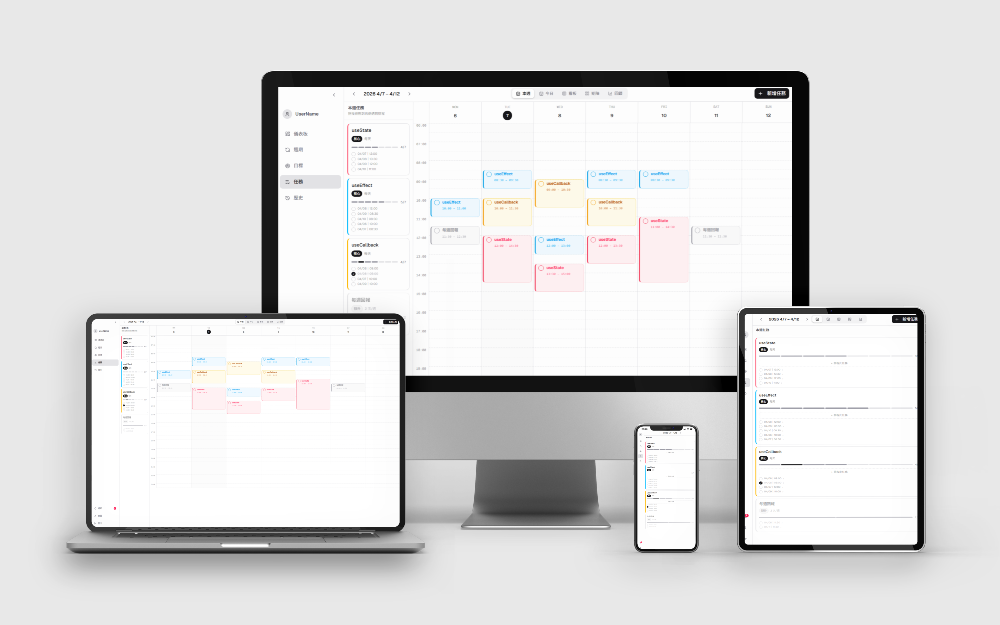

## Features

- 12-Week Cycle Tracking: Transform long-term visions into actionable 12-week plans with visual progress tracking (W1–W12).

- Strategic Task Hierarchy: Organize goals with nested task structures and Eisenhower Matrix prioritization (Urgent vs. Important).

- Interactive Weekly Planner: Seamlessly schedule tasks via drag-and-drop calendar, optimized for both desktop and mobile.

- Analytics & Reflection: Monitor growth with real-time dashboards and structured weekly reviews to track execution and mood.

- Smart Sync & Alerts: Stay consistent with automated task notifications and secure Google OAuth integration.

## Tech Stack

| **Category**           | **Technique**                                                                                                                                                                                                                                                                                                                                                                                                                                 |
| ---------------------- | --------------------------------------------------------------------------------------------------------------------------------------------------------------------------------------------------------------------------------------------------------------------------------------------------------------------------------------------------------------------------------------------------------------------------------------------- |
| **Frontend**           |     |
| **UI Library**         |                                                                                                                                                                                                                                                |
| **Drag & Drop**        |                                                                                                                                                                                                                                                                                                                                                                  |
| **State Management**   |                                                                                                                                                                                |
| **Backend / Database** |                                                                                                                                                                                                                                             |
| **Version Control**    |                                                                                                                                                                                                                                              |
| **Deployment**         |                                                                                                                                                                                                                                                                                                                                          |

## Page Flow

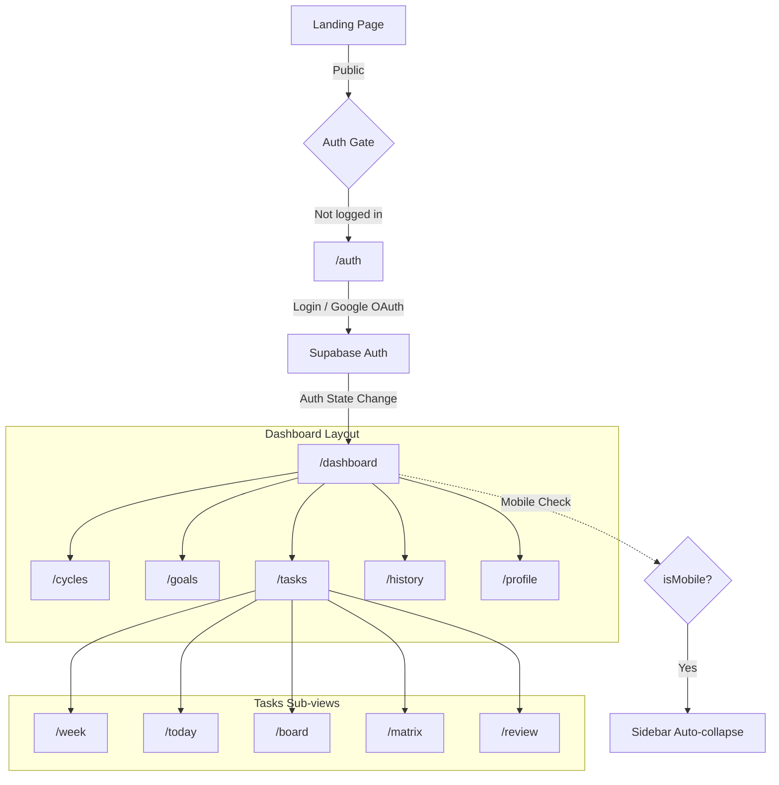

## State Management

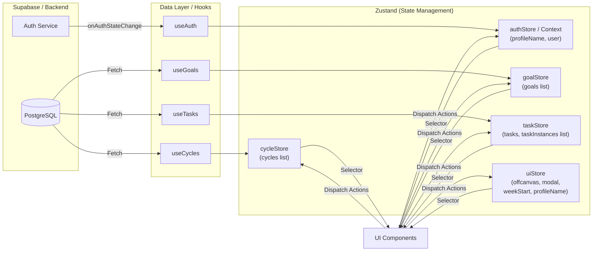

- **React Context (AuthContext)：** Auth state is pushed by Supabase onAuthStateChange — no manual actions needed, making Context the right fit.
- **Zustand Store：** All other data states require manual updates; uiStore.currentWeekStart ensures week/board/review pages stay in sync across navigation.

## Demo

### Cycle Management

- Create 12-week execution plans with name and vision.
- Status flow: Planning → Active → Completed.
  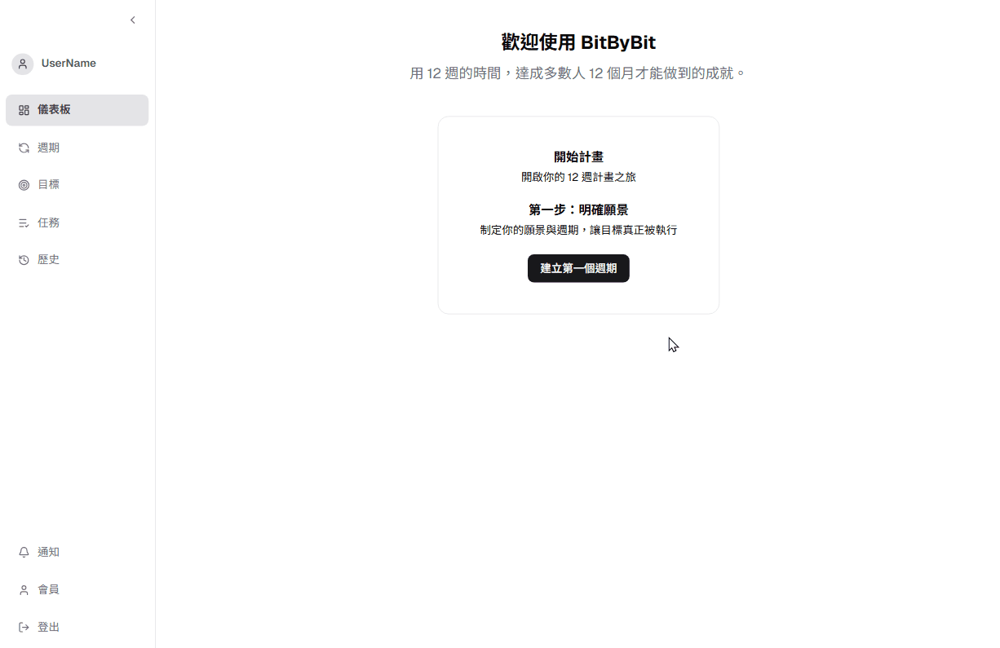

### Goals & Task Management

- Nested goal-task structure with core/extra task categories.
- Four-quadrant priority (Urgent × Important matrix).
- Configurable frequency (daily / N times per week) and execution weeks.
  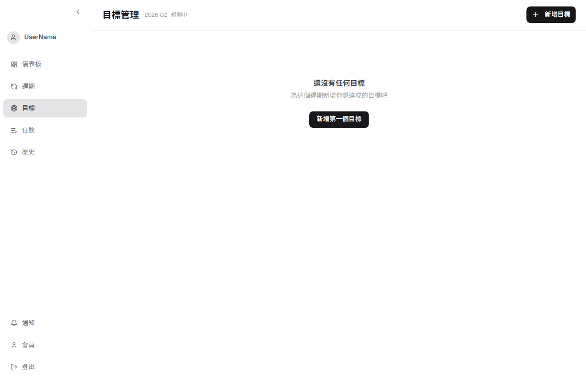

### Weekly View (Drag & Drop Scheduling)

- Side-by-side task list + weekly calendar.
- Drag tasks to specific time slots — Pointer Events for precise drop position.
- Resize CalendarEvent blocks to adjust duration.
- Mobile: tap + Offcanvas scheduling, shared business logic.
  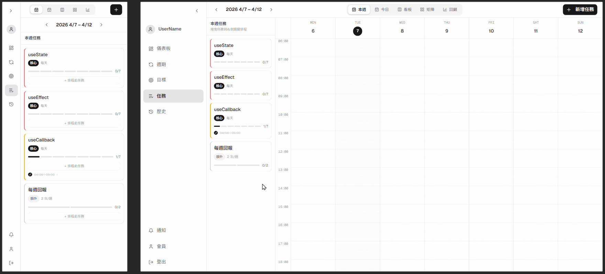

### Today View

- Automatically filters your weekly schedule to surface today’s tasks, keeping your focus strictly on immediate priorities.
  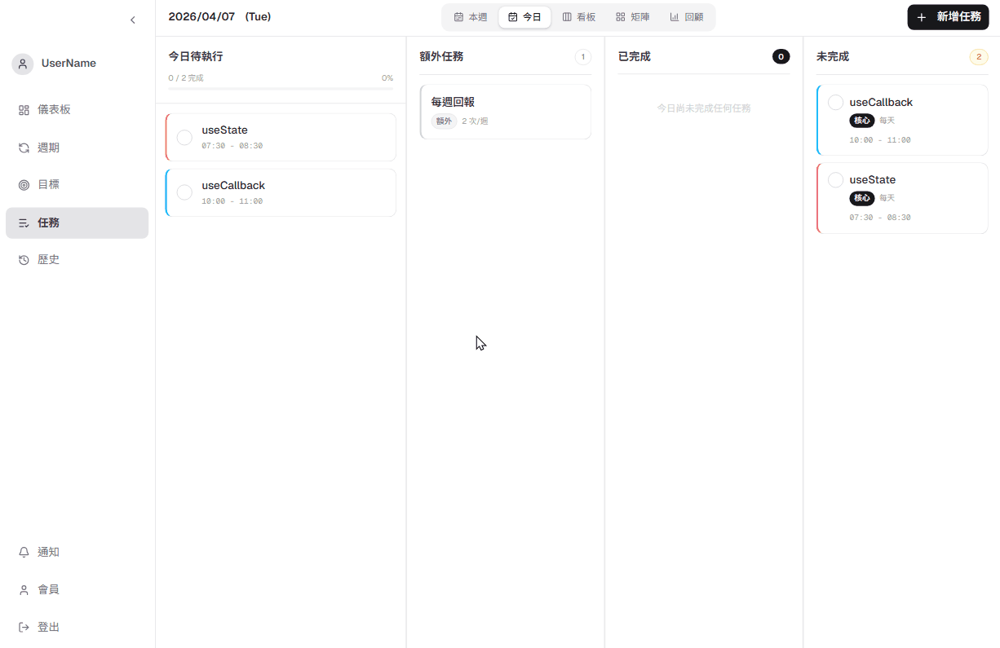

### Task Board & Matrix

- Kanban with 4 columns: Unscheduled / Expired / In Progress / Completed
- "Move to Next Week" action for expired tasks.
- Drag matrix cards to change priority, syncs to Goals page instantly.
  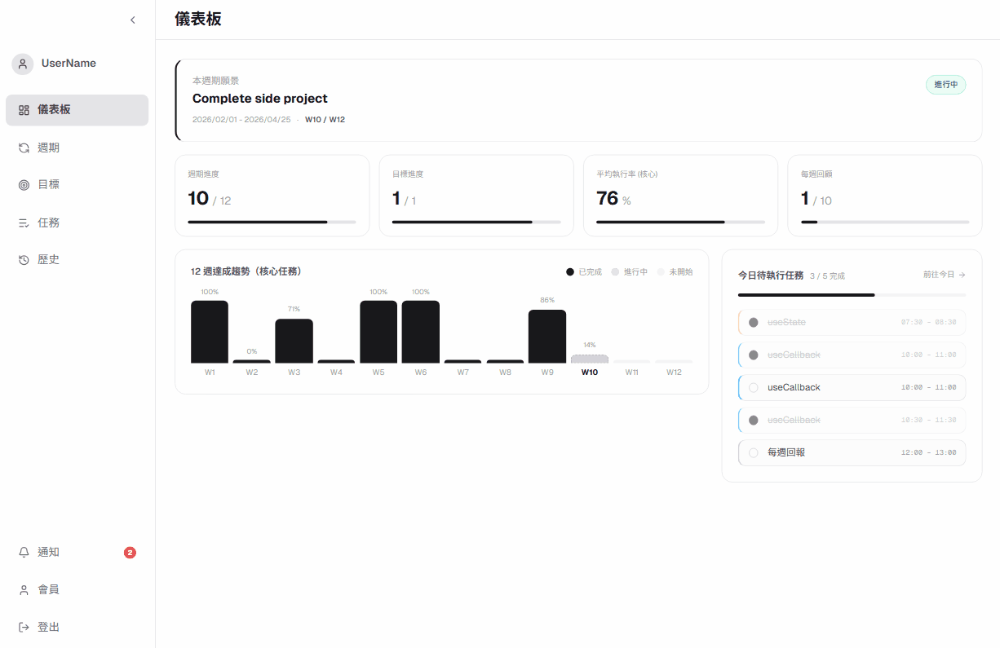
  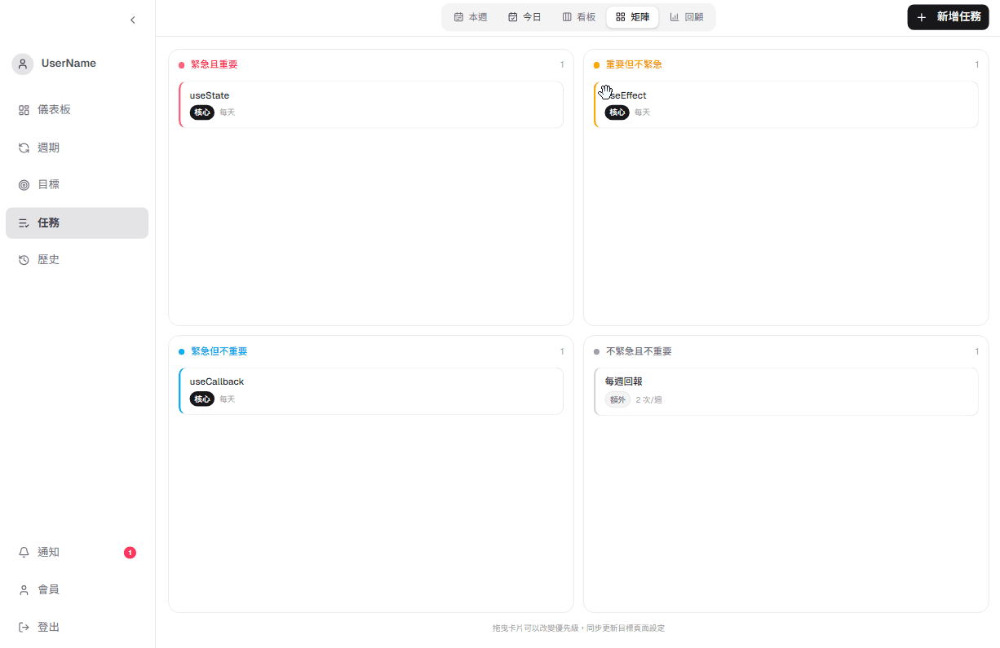

### Weekly Review

- Multi-field review form: Execution / Learning / Reflection / Mood rating.
- Unlocks on Sunday; past weeks can be back-filled.
- Review count synced to Dashboard stats.
  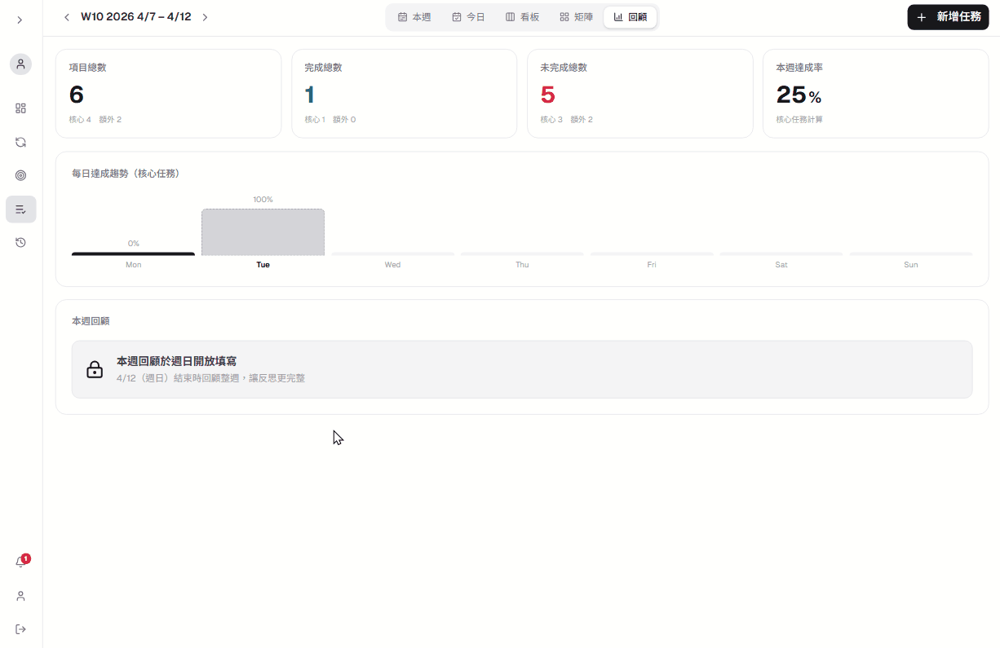

### Cycle Retrospective

- Review your execution across the full 12-week cycle with detailed weekly completion rates. Features color-coded performance benchmarks for intuitive, at-a-glance progress analysis.
  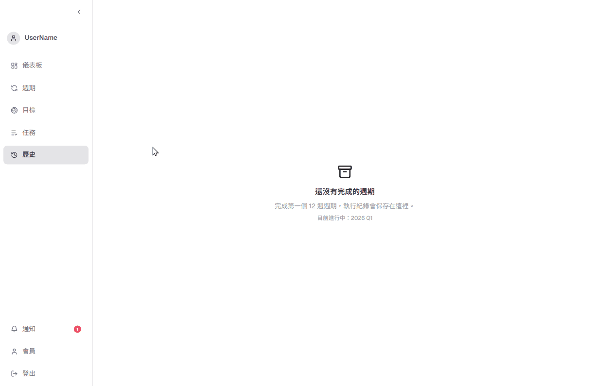
