<div align="center">
  <h1>BitByBit</h1>
  <p>
    <a href="https://bitbybit-plan.vercel.app/"><b>Website</b></a> ｜
    <a href="#features"><b>Features</b></a> ｜
    <a href="#tech-stack"><b>Tech Stack</b></a> ｜
    <a href="#demo"><b>Demo</b></a>
  </p>
  <p>
    English｜<a href="./README.zh-TW.md">繁體中文</a>
  </p>
</div>

BitByBit is a 12-week goal tracking system that turns vague ambitions into actionable roadmaps.

Based on the "12-Week Year" methodology, it breaks down big goals into executable daily tasks using a 12-week cycle framework. Drag-and-drop scheduling, progress tracking, and weekly reviews build a continuous improvement loop.

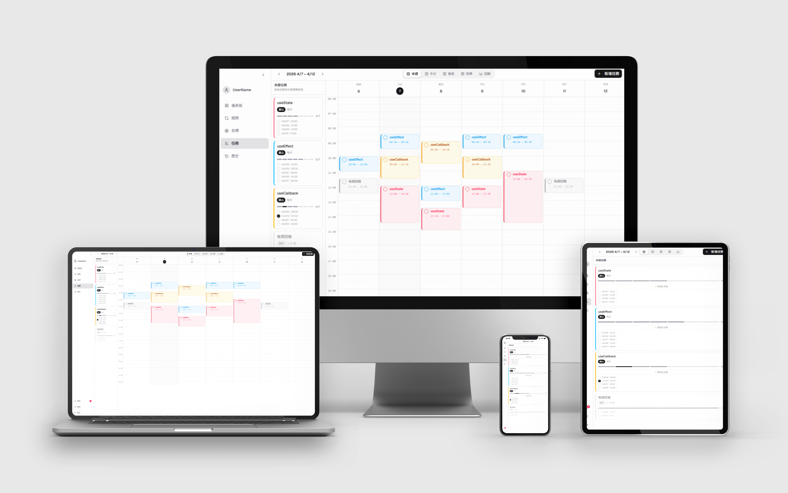

## Features

- 12-Week Cycle Tracking: Transform long-term visions into actionable 12-week plans with visual progress tracking (W1–W12).

- Strategic Task Hierarchy: Organize goals with nested task structures and Eisenhower Matrix prioritization (Urgent vs. Important).

- Interactive Weekly Planner: Drag-and-drop scheduling via @dnd-kit with Pointer Events for precise drop positioning. Mobile uses tap + Offcanvas with shared business logic across both experiences.

- Analytics & Reflection: Real-time dashboard showing completion rate, total tasks, and review streaks. Weekly review unlocks on Sunday with back-fill support for past weeks; mood rating and reflection fields structured for pattern recognition.

- Smart Sync & Alerts: Stay consistent with automated task notifications and secure Google OAuth integration.

## Tech Stack

| **Category**           | **Technique**                                                                                                                                                                                                                                                                                                                                                                                                                                 |
| ---------------------- | --------------------------------------------------------------------------------------------------------------------------------------------------------------------------------------------------------------------------------------------------------------------------------------------------------------------------------------------------------------------------------------------------------------------------------------------- |
| **Frontend**           |     |
| **UI Library**         |                                                                                                                                                                                                                                                |
| **Drag & Drop**        |                                                                                                                                                                                                                                                                                                                                                                  |
| **State Management**   |                                                                                                                                                                                |
| **Backend / Database** |                                                                                                                                                                                                                                             |
| **Version Control**    |                                                                                                                                                                                                                                              |
| **Deployment**         |                                                                                                                                                                                                                                                                                                                                          |

## Page Flow

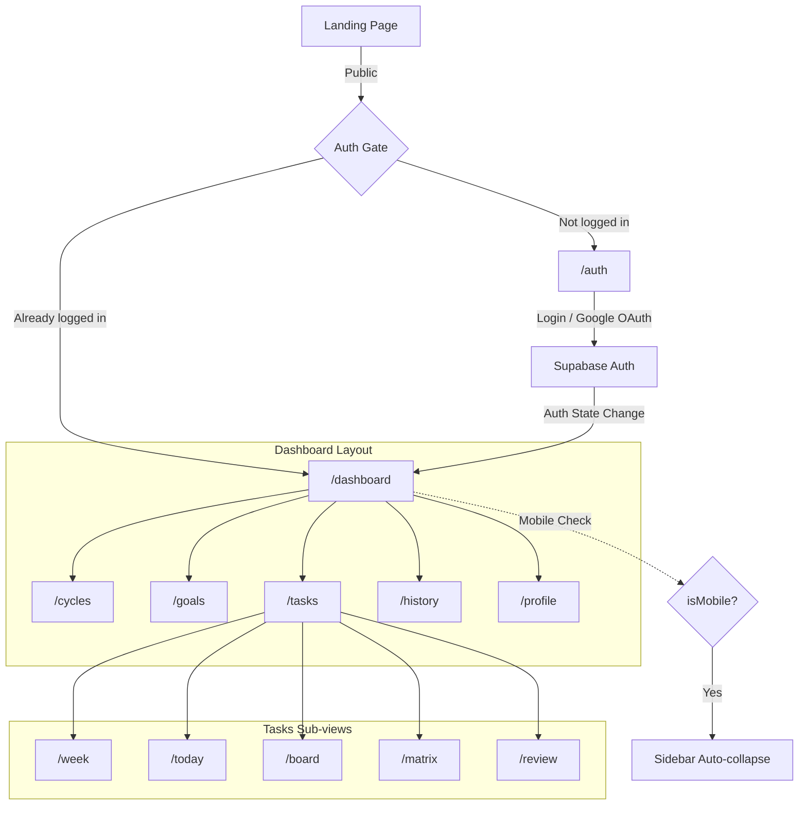
```mermaid
graph TD
    A[Landing Page] -->|Public| B{Auth Gate}
    B -->|Not logged in| C[ /auth ]
    B -->|Already logged in| E[ /dashboard ]
    C -->|Login / Google OAuth| D[Supabase Auth]
    D -->|Auth State Change| E[ /dashboard ]

    subgraph Protected_Routes [Dashboard Layout]
        E --> F[ /cycles ]
        E --> G[ /goals ]
        E --> H[ /tasks ]
        E --> I[ /history ]
        E --> J[ /profile ]
    end

    subgraph Tasks_Tab_Navigation [Tasks Sub-views]
        H --> H1[ /week ]
        H --> H2[ /today ]
        H --> H3[ /board ]
        H --> H4[ /matrix ]
        H --> H5[ /review ]
    end

    E -.->|Mobile Check| K{isMobile?}
    K -->|Yes| L[Sidebar Auto-collapse]
```

## State Management

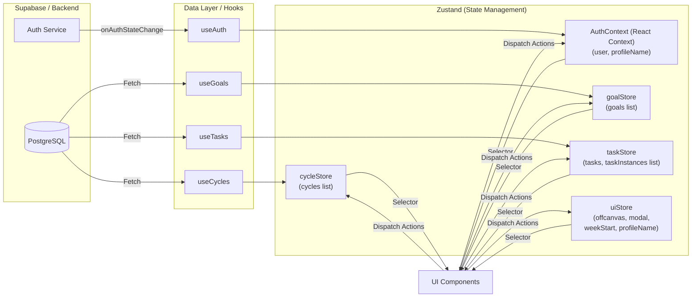
```mermaid
graph LR
    subgraph Data_Source ["Supabase / Backend"]
        DB[(PostgreSQL)]
        AU[Auth Service]
    end

    subgraph Custom_Hooks ["Data Layer / Hooks"]
        H1[useAuth]
        H2[useCycles]
        H3[useGoals]
        H4[useTasks]
    end

    subgraph Zustand_Stores ["Zustand (State Management)"]
        direction TB
        S1["AuthContext (React Context)<br/>(user, profileName)"]
        S2["cycleStore<br/>(cycles list)"]
        S3["goalStore<br/>(goals list)"]
        S4["taskStore<br/>(tasks, taskInstances list)"]
        S5["uiStore<br/>(offcanvas, modal,<br/> weekStart, profileName)"]
    end

    DB -->|Fetch| H2 & H3 & H4
    AU -->|onAuthStateChange| H1

    H1 --> S1
    H2 --> S2
    H3 --> S3
    H4 --> S4

    S1 & S2 & S3 & S4 & S5 -->|Selector| UI[UI Components]
    UI -->|Dispatch Actions| S1 & S2 & S3 & S4 & S5
```

- **React Context (AuthContext)：** Auth state is driven by Supabase `onAuthStateChange` — reactive and push-based, so React Context is the natural fit with no manual dispatch needed.
- **Zustand Stores：** All other data requires explicit mutation after Supabase CRUD calls. Stores are thin slices (state + setters only, no async logic) — all Supabase calls live in hooks, which push results into stores after mutation.
- **uiStore.currentWeekStart：** Single source of truth shared across week / board / review views, keeping navigation in sync regardless of which tab is active.

## Database Schema

Core data model follows a strict hierarchy: **Cycle → Goal → Task → TaskInstance**

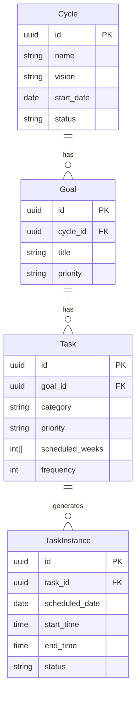
```mermaid
erDiagram
    Cycle ||--o{ Goal : has
    Goal ||--o{ Task : has
    Task ||--o{ TaskInstance : generates

    Cycle {
        uuid id PK
        string name
        string vision
        date start_date
        string status
    }
    Goal {
        uuid id PK
        uuid cycle_id FK
        string title
        string priority
    }
    Task {
        uuid id PK
        uuid goal_id FK
        string category
        string priority
        int[] scheduled_weeks
        int frequency
    }
    TaskInstance {
        uuid id PK
        uuid task_id FK
        date scheduled_date
        time start_time
        time end_time
        string status
    }
```

| Entity           | Key Fields                                                                                   | Notes                                          |
| ---------------- | -------------------------------------------------------------------------------------------- | ---------------------------------------------- |
| **Cycle**        | `status: planning → active → completed`                                                      | One active cycle at a time; 12 weeks / 83 days |
| **Goal**         | `priority: main \| sub`                                                                      | Belongs to one cycle                           |
| **Task**         | `category: core \| extra`, `priority` (4-quadrant), `scheduled_weeks: number[]`, `frequency` | Defines recurrence rules; no concrete dates    |
| **TaskInstance** | `status: unscheduled → scheduled → completed \| expired`, `scheduled_date`, time range       | Concrete scheduled unit generated from a Task  |

## Quick Start

```bash
git clone https://github.com/1denx/bitbybit.git
cd bitbybit
npm install
```

Create a `.env.local` file in the project root:

```env
NEXT_PUBLIC_SUPABASE_URL=your_supabase_url
NEXT_PUBLIC_SUPABASE_ANON_KEY=your_supabase_anon_key
```

```bash
npm run dev
```

Open [http://localhost:3000](http://localhost:3000) in your browser.

## Demo

### Cycle Management

- Create 12-week execution plans with name and vision.
- Status flow: Planning → Active → Completed.
  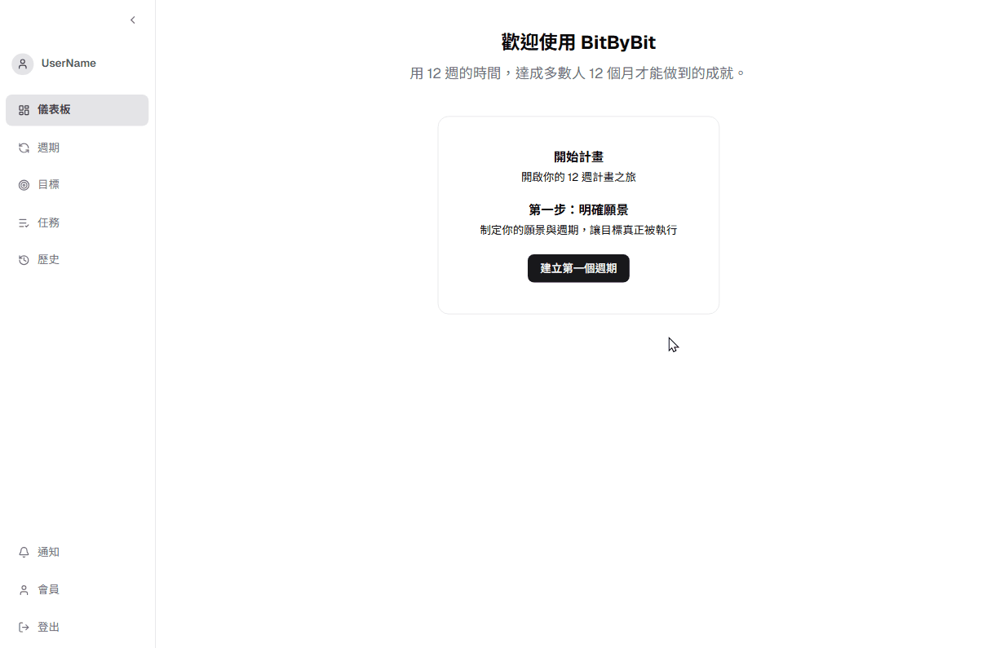

### Goals & Task Management

- Nested goal-task structure with core/extra task categories.
- Four-quadrant priority (Urgent × Important matrix).
- Configurable frequency (daily / N times per week) and execution weeks.
  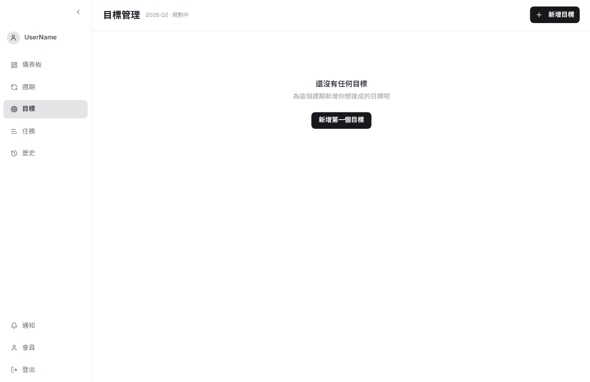

### Weekly View (Drag & Drop Scheduling)

- Side-by-side task list + weekly calendar.
- Drag tasks to specific time slots — Pointer Events for precise drop position.
- Resize CalendarEvent blocks to adjust duration.
- Mobile: tap + Offcanvas scheduling, shared business logic.
  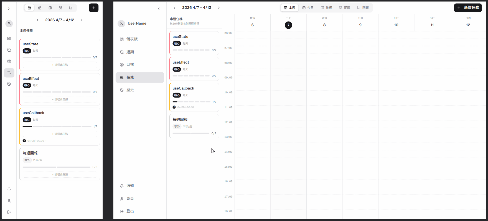

### Today View

- Automatically filters your weekly schedule to surface today’s tasks, keeping your focus strictly on immediate priorities.
  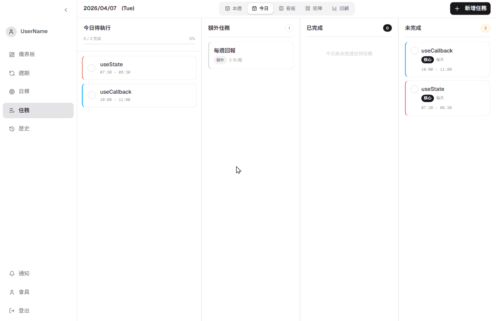

### Task Board & Matrix

- Kanban with 4 columns: Unscheduled / Expired / In Progress / Completed
- "Move to Next Week" action for expired tasks.
- Drag matrix cards to change priority, syncs to Goals page instantly.
  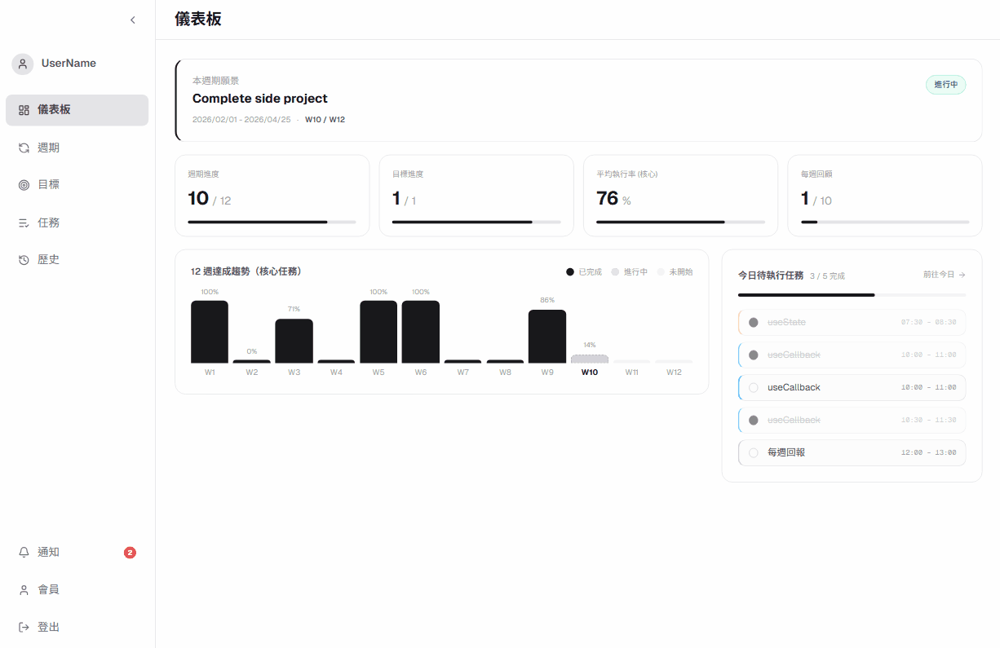
  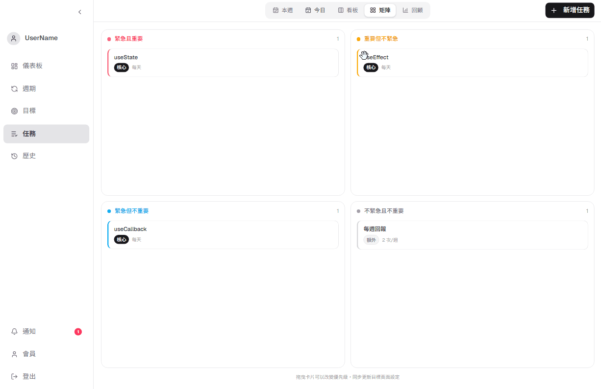

### Weekly Review

- Multi-field review form: Execution / Learning / Reflection / Mood rating.
- Unlocks on Sunday; past weeks can be back-filled.
- Review count synced to Dashboard stats.
  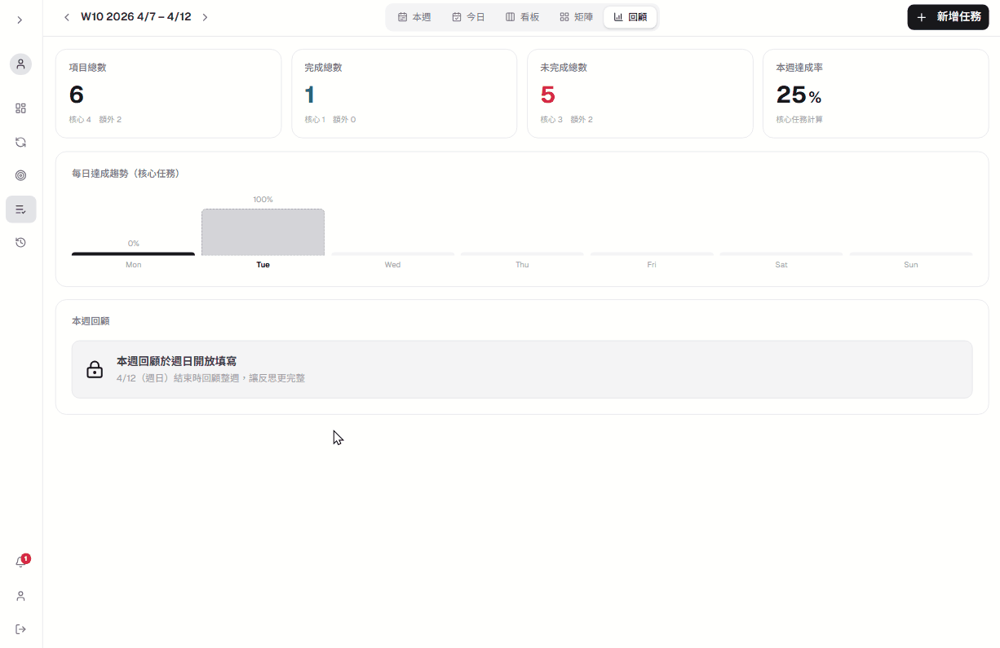

### Cycle Retrospective

- Review your execution across the full 12-week cycle with detailed weekly completion rates. Features color-coded performance benchmarks for intuitive, at-a-glance progress analysis.
  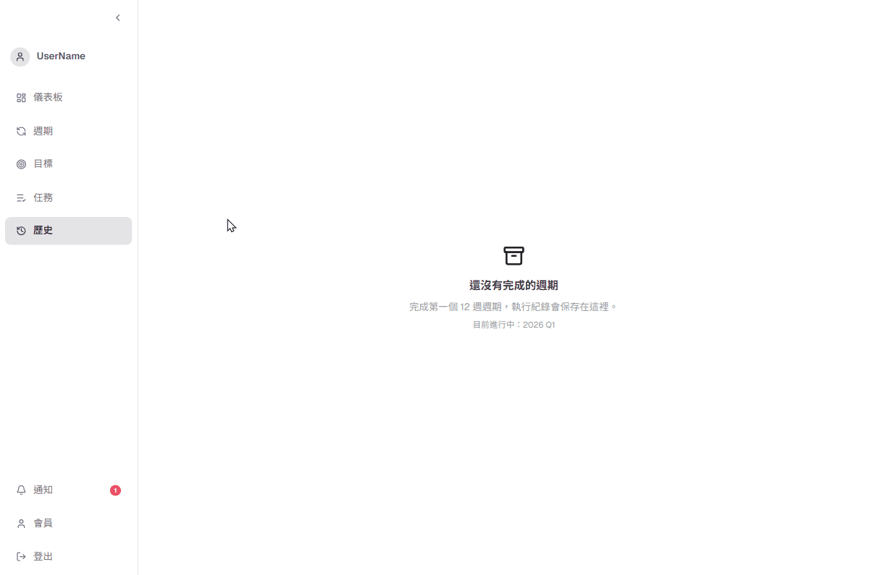
