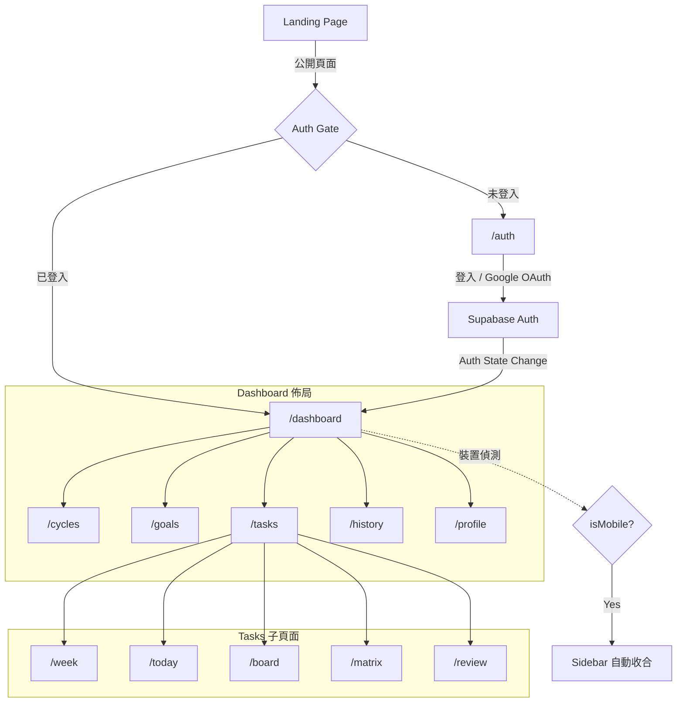
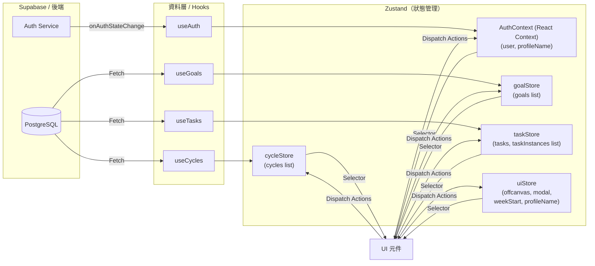
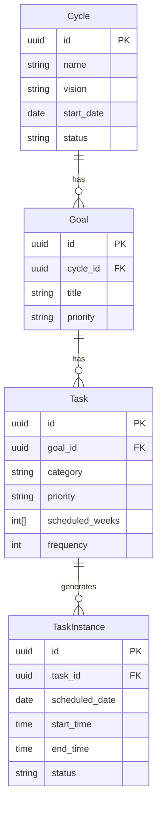

<div align="center">
  <h1>BitByBit</h1>
  <p>
    <a href="https://bitbybit-plan.vercel.app/"><b>網站</b></a> ｜
    <a href="#功能介紹"><b>功能介紹</b></a> ｜
    <a href="#技術棧"><b>技術棧</b></a> ｜
    <a href="#功能展示"><b>功能展示</b></a>
  </p>
  <p>
    <a href="./README.md">English</a> ｜ 繁體中文
  </p>
</div>

BitByBit 是一套以 12 週為單位的目標追蹤系統，將模糊的的目標轉化為清晰、可執行的行動藍圖。

與年度計劃不同，「一年 12 週」是一種全新的時間管理法，意指「把 12 週當成你的一年」。透過 12 週週期框架將大目標分解為每日可執行任務。拖曳排程、進度追蹤與每週回顧，共同構建持續改善的執行迴圈。


## 功能介紹

- **12 週週期追蹤**：將長期願景轉化為有視覺進度的 12 週行動計畫（W1–W12）。

- **策略性任務層級**：以巢狀結構組織目標，並透過艾森豪矩陣進行四象限優先度分類（緊急 vs. 重要）。

- **互動式週計畫**：基於 @dnd-kit 的拖曳排程，搭配 Pointer Events 實現精準落點定位。行動裝置採用點擊 + Offcanvas 操作，與桌機共用相同業務邏輯。

- **數據分析與回顧**：即時 Dashboard 顯示完成率、任務總數與回顧連續天數。每週回顧於週日解鎖，支援補填過去週次；心情評分與反思欄位設計用於長期模式識別。

- **智慧同步與提醒**：自動化任務通知保持執行一致性，搭配安全的 Google OAuth 整合。

## 技術棧

| **分類**          | **技術**                                                                                                                                                                                                                                                                                                                                                                                                                                      |
| ----------------- | --------------------------------------------------------------------------------------------------------------------------------------------------------------------------------------------------------------------------------------------------------------------------------------------------------------------------------------------------------------------------------------------------------------------------------------------- |
| **前端**          |     |
| **UI 元件庫**     |                                                                                                                                                                                                                                                |
| **拖曳功能**      |                                                                                                                                                                                                                                                                                                                                                                  |
| **狀態管理**      |                                                                                                                                                                                |
| **後端 / 資料庫** |                                                                                                                                                                                                                                             |
| **版本控制**      |                                                                                                                                                                                                                                              |
| **部署**          |                                                                                                                                                                                                                                                                                                                                          |

## 頁面流程



## 狀態管理



- **React Context（AuthContext）：** Auth 狀態由 Supabase `onAuthStateChange` 被動推送，非常適合 React Context，無需手動 dispatch。
- **Zustand Stores：** 其餘資料需在 Supabase CRUD 後主動更新。Store 只存放狀態與 setter，不含任何非同步邏輯；所有 Supabase 呼叫集中在 hooks 中，操作完成後再推入 store。
- **uiStore.currentWeekStart：** 週計畫 / 看板 / 回顧頁面共用的單一狀態來源，確保跨頁切換時週次保持同步。

## 資料庫結構

核心資料模型遵循嚴格的層級關係：**Cycle → Goal → Task → TaskInstance**



| 實體             | 關鍵欄位                                                                                  | 說明                                    |
| ---------------- | ----------------------------------------------------------------------------------------- | --------------------------------------- |
| **Cycle**        | `status: planning → active → completed`                                                   | 同時只有一個進行中的週期；12 週 / 83 天 |
| **Goal**         | `priority: main \| sub`                                                                   | 隸屬於單一 Cycle                        |
| **Task**         | `category: core \| extra`、`priority`（四象限）、`scheduled_weeks: number[]`、`frequency` | 定義重複規則，不含具體日期              |
| **TaskInstance** | `status: unscheduled → scheduled → completed \| expired`、`scheduled_date`、時間區間      | 由 Task 產生的具體排程單元              |

## 快速開始

```bash
git clone https://github.com/1denx/bitbybit.git
cd bitbybit
npm install
```

在專案根目錄建立 `.env.local`：

```env
NEXT_PUBLIC_SUPABASE_URL=your_supabase_url
NEXT_PUBLIC_SUPABASE_ANON_KEY=your_supabase_anon_key
```

```bash
npm run dev
```

在瀏覽器開啟 [http://localhost:3000](http://localhost:3000)。

## 功能展示

### 週期管理

- 建立包含名稱與願景的 12 週執行計畫。
- 狀態流程：規劃中 → 進行中 → 已完成。
  

### 目標與任務管理

- 巢狀目標任務結構，支援核心 / 額外任務分類。
- 四象限優先度（緊急 × 重要矩陣）。
- 可設定執行頻率（每日 / 每週 N 次）與執行週次。
  

### 週計畫（拖曳排程）

- 左側任務列表 + 右側週曆並列顯示。
- 拖曳任務至特定時間格 — Pointer Events 確保精準落點。
- 拖拉 CalendarEvent 區塊邊緣以調整持續時間。
- 行動裝置：點擊 + Offcanvas 排程，與桌機共用業務邏輯。
  

### 今日任務

- 自動篩選當週排程，只顯示今天的任務，讓執行焦點保持清晰。
  

### 任務看板與矩陣

- 看板四欄：未排程 / 已過期 / 進行中 / 已完成。
- 過期任務支援「移至下週」操作。
- 拖曳矩陣卡片以變更優先度，即時同步至目標頁面。
  
  

### 每週回顧

- 多欄位回顧表單：執行狀況 / 學習 / 反思 / 心情評分。
- 週日解鎖；支援補填過去週次。
- 回顧次數即時同步至 Dashboard 統計。
  

### 週期回顧

- 以完整 12 週視角檢視執行成效，附每週完成率明細。色碼化績效基準讓進度一目了然。
  
